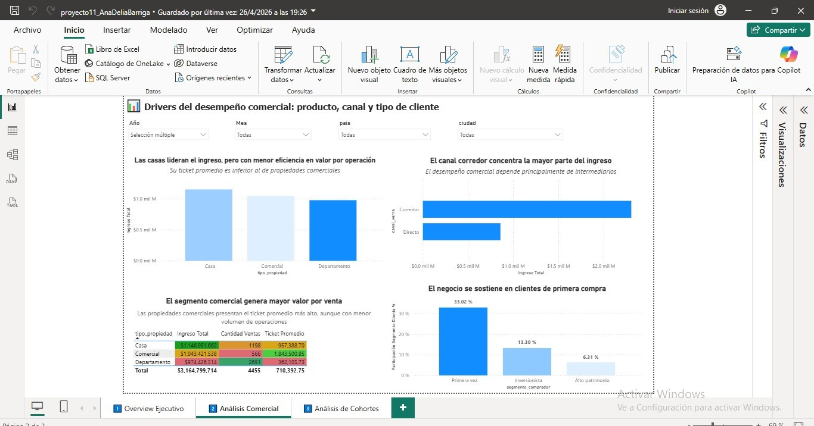

Estrategia Comercial de Andes Capital Real Estate

📊 Descripción del Proyecto
Desarrollo de un dashboard interactivo para analizar el desempeño comercial de Andes Capital Real Estate, integrando información de ventas, clientes y propiedades para apoyar decisiones estratégicas de crecimiento, rentabilidad y recurrencia de clientes.

🎯 Objetivos
Analizar ingresos y desempeño comercial de ventas inmobiliarias.
Identificar los tipos de propiedad y segmentos de clientes más rentables.
Evaluar tendencias de ventas y crecimiento Year over Year (YoY).
Analizar recurrencia y comportamiento de compra mediante cohortes.
Diseñar visualizaciones ejecutivas para facilitar la toma de decisiones.

🔍 Metodología
Limpieza y validación de datos transaccionales y dimensionales.
Construcción de un modelo analítico en esquema estrella.
Creación de métricas comerciales e inteligencia de tiempo.
Desarrollo de KPIs de ventas, comisiones y recurrencia de clientes.
Diseño de dashboards ejecutivos con enfoque en análisis comercial y comportamiento de clientes.
Aplicación de cohortes para evaluar recompra y retención.

📈 Resultados Principales
✅ Identificación de segmentos de clientes y tipos de propiedad con mayor generación de ingresos.
✅ Visualización de tendencias comerciales y crecimiento anual del negocio.
✅ Detección de patrones de recompra y recurrencia de clientes.
✅ Generación de dashboards ejecutivos para monitoreo de KPIs y toma de decisiones estratégicas.

🛠️ Herramientas Utilizadas
Power BI / Tableau — visualización y construcción de dashboards
Modelado de Datos — esquema estrella y relaciones analíticas
DAX / Medidas Calculadas — KPIs e inteligencia de tiempo
Excel / Data Cleaning — validación y preparación de datos
Análisis de Cohortes — recurrencia y comportamiento de clientes

📁 Estructura del Proyecto
dashboard_real_estate.pbix / tableau_workbook — dashboard interactivo final
datasets/ — tablas de ventas, clientes y propiedades
modelo_estrella/ — relaciones y estructura analítica
executive_summary.pdf — resumen ejecutivo e insights de negocio

🎓 Contexto Académico
Proyecto desarrollado en: TripleTen Bootcamp (2026)
Enfoque: Business Intelligence, análisis comercial inmobiliario y visualización ejecutiva de datos.

Este proyecto demuestra habilidades en business analytics, modelado de datos, diseño de dashboards ejecutivos e interpretación de métricas comerciales orientadas a negocio y toma de decisiones estratégicas.
